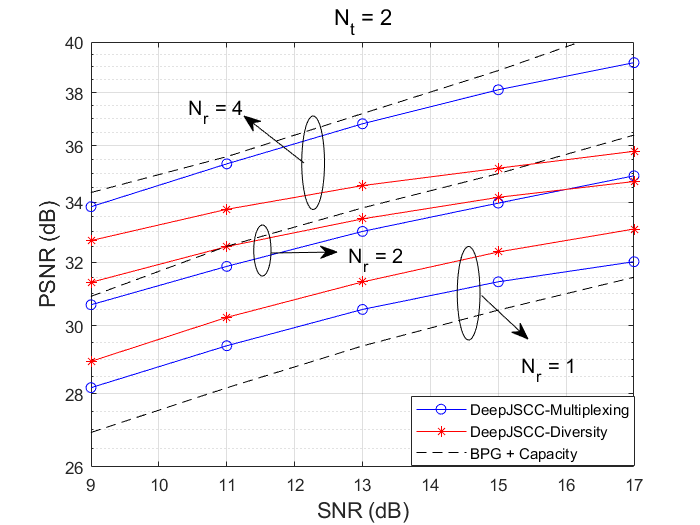

# Space-time JSCC over MIMO channel
Source code for "Space-time design for deep joint source channel coding of images Over MIMO channels", SPAWC 2023, https://ieeexplore.ieee.org/document/10304536

## Introduction
Diversity-Multiplexing trade-off for MIMO systems has been extensively studied in digital communication systems (Zheng & Tse). However, for the emerging semantic communications
there is no prior work exploring this. Thus, we first explore the simplest diversity-multiplexing trade-off for the semantic communications, where the system performance using 
orthogonal space-time codes (OSTBC) which represents **diversity** and the spatial multiplexing scheme representing **multiplexing** are studied.
It is shown that by using the OSTBC, the **diversity** system can outperform the **multiplexing** scheme when $N_r$ is small and low channel SNR:

## Dependency
- Python (3.6.9 or above)
- numpy
- pytorch 1.10.0+cu102
- compressai (pip install compressai)

## Reproduce
Basically, directly run the 'run.py' will generate the performance of the **diversity** scheme for a 2x2 MIMO system. To generate the performance for other scenarios,
please alternate the parameters in 'get_args.py'. 

E.g., for **multiplexing** scheme, change the 'args.diversity' to false. args.distributed assumes that the two antennas may belong the 
two users (distributed MIMO), for conventional MIMO system, place it to false. Also, $P1, P2$ should be set to the same for conventional MIMO, it can be
different for a distributed MIMO, though. 

Note that the SNR defination in this repo is different from our another DeepJSCC-MIMO paper (https://arxiv.org/abs/2309.00470), where another one can be implementated via belows lines:
`noise_stddev=torch.sqrt(10**(-snr/10)*Nt/2)'.

## Baseline

It is worth mentioning the implementation of the baseline as follows:

We only provide the BPG + MIMO capacity scheme which is because our implementation for digital baseline gives a very bad PSNR performance, thus we only provide the 
upper bound of all digital schemes by assuming MIMO capacity.

The MIMO Capacity is calculated as $C(H) = log2(det(I+\frac{P}{\sigma^2}H'H))$ for arbitary $H$. Note that we will compress an image based on that instantaneous capacity to obtain
the PSNR value. These values will be averaged over all $10^5$ different MIMO implementations and the entire dataset.

Interested readers can also implement the baseline where the transmitter uses BPG + LDPC + QAM and the receiver employs Sphere decoding + LDPC decoder. Based on our experiments, 
this gives unstatsifactory results. The sphere decoding block can be found in Matlab builtin function: comm.SphereDecoder.

## Acknowledge
Thanks for Tung-Tze Yang for providing the codes for the DeepJSCC-Q paper.
